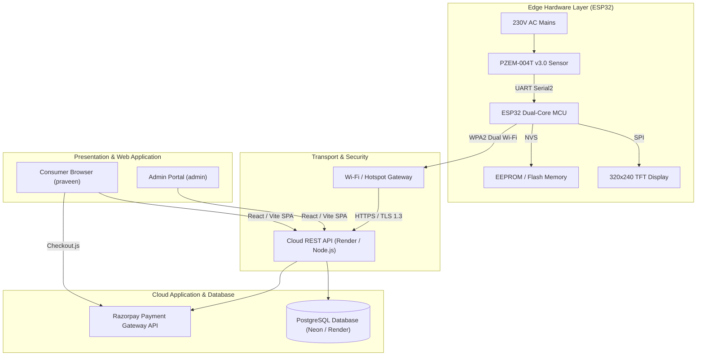
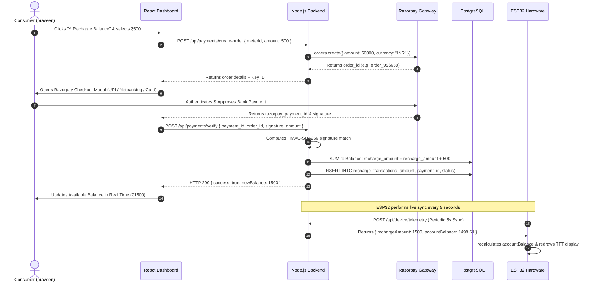
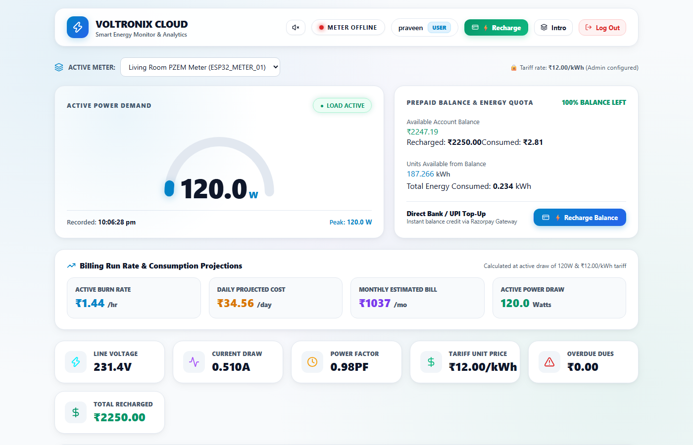
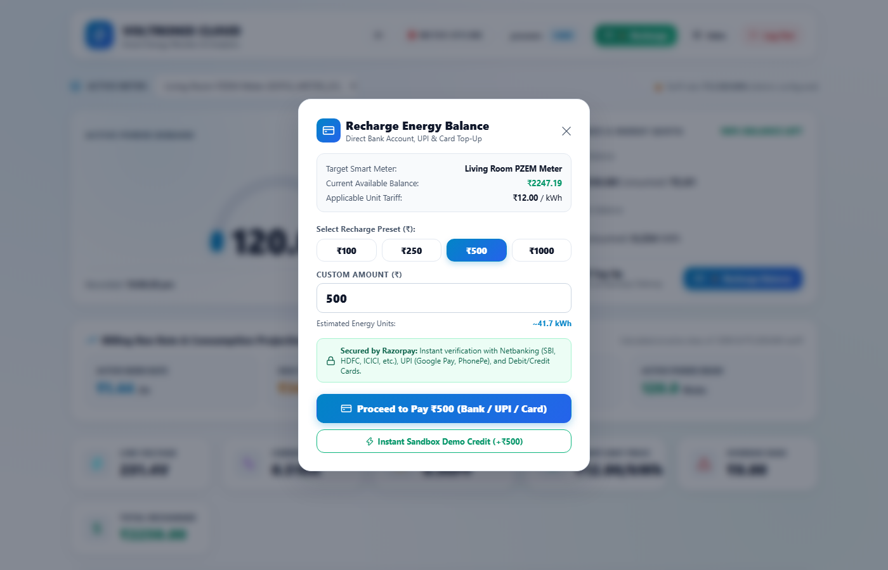
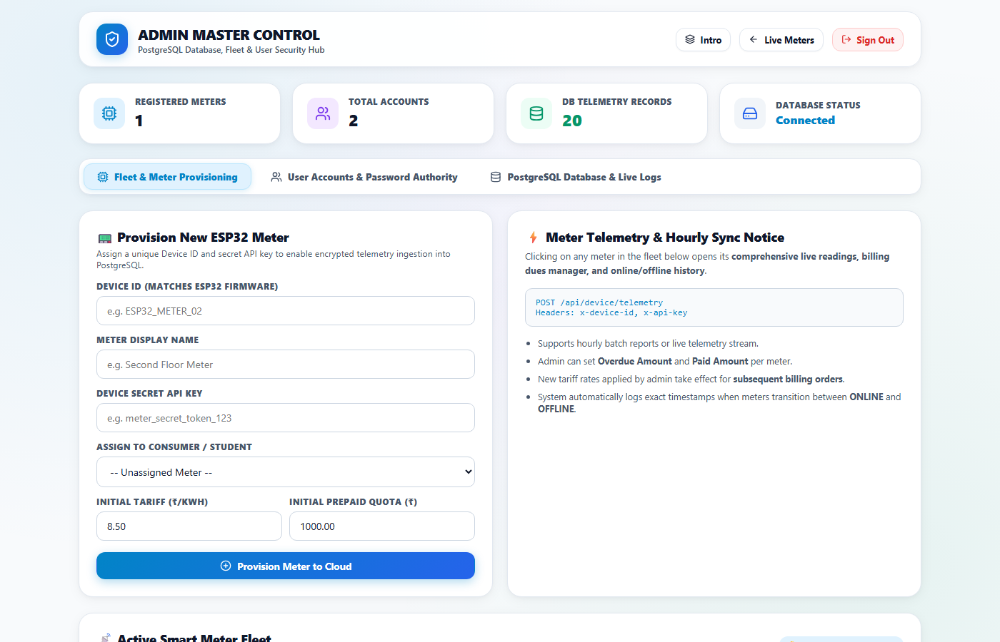
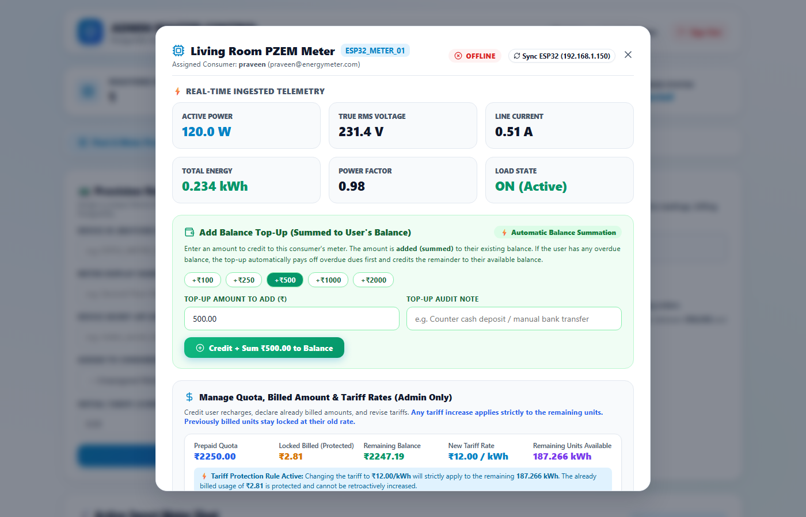

# SMART ENERGY METER & AI-DRIVEN TARIFF CLOUD PLATFORM
## Comprehensive Technical Project Report & Architectural Specifications

---

### Executive Overview

The **Smart Energy Meter & Cloud Intelligence Platform** (VOLTRONIX CLOUD) is an enterprise-grade, end-to-end Internet of Things (IoT) power monitoring and prepaid utility automation system. The platform bridges high-precision physical AC sensing hardware with modern cloud microservices, enabling real-time telemetry streaming, cryptographic payment processing via Razorpay, dynamic multi-tiered tariff configuration, and automated balance reconciliation between cloud databases and edge microcontroller displays.

---

## 1. System Access Credentials

The platform is pre-configured with role-based access control (RBAC), segregating administrative authority from consumer usage:

| Account Type | Username / Identifier | Password | Access Level & Scope |
| :--- | :--- | :--- | :--- |
| **Super Administrator** | `admin` | `123` | Full Fleet Governance, PostgreSQL Audit Logs, Quota & Tariff Management, Balance Top-Up Summation, Meter Provisioning |
| **Consumer User** | `praveen` | `123` | Live Meter Demand, Self-Service Bank Recharge (Razorpay), Historical Consumption Ledger, Load Session Audits |

> **Note:** All authentication requests are processed via `POST /api/auth/login`, issuing signed JSON Web Tokens (JWT) with 7-day expiration and BCrypt password encryption.

---

## 2. Technology Stack & Architecture Breakdown



### 2.1 Hardware & Embedded Firmware Layer
- **Microcontroller:** ESP32 Dual-Core Tensilica Xtensa 32-bit LX6 Microprocessor (240 MHz, 520 KB SRAM).
- **Energy Sensor:** PZEM-004T v3.0 high-precision AC power meter module measuring True RMS Voltage (80–260V AC), Line Current (0–100A via CT), Active Power (0–23kW), Energy (0–9999kWh), and Power Factor (0.00–1.00).
- **On-Device Display:** 2.4" / 2.8" SPI TFT LCD (320x240 resolution, ST7789 / ILI9341 controller driven via `TFT_eSPI`).
- **Resilience Engine:** ESP32 Non-Volatile Storage (`Preferences.h` / NVS) with power-cut fail-safe persistence for uninterrupted load session tracking.
- **Embedded Web Server:** Lightweight asynchronous HTTP server (`WebServer.h`) hosting local diagnostic dashboards directly at `http://<ESP32_LOCAL_IP>/`.

### 2.2 Cloud Backend API Layer
- **Runtime:** Node.js (v18+ LTS).
- **Web Framework:** Express.js with JSON body parsing, CORS headers, and Morgan logging.
- **Security & Authorization:** Cryptographic JSON Web Tokens (`jsonwebtoken`), BCrypt (`bcryptjs`) salt hashing (cost factor 10), and API key-authenticated headers (`x-device-id`, `x-api-key`).
- **Payment Processing SDK:** Official `razorpay` Node.js client (`^2.9.8`) with HMAC-SHA256 signature verification (`crypto`).

### 2.3 Relational Database Layer
- **Database Engine:** PostgreSQL 16 (Hosted on Render / Neon Serverless Postgres).
- **Connection Pooling:** `pg` (`node-postgres`) connection pool with SSL/TLS encryption.
- **Schema Design:** Normalized third normal form (3NF) relational tables with composite b-tree indexing for high-frequency time-series queries.

### 2.4 Frontend Web Application Layer
- **Core Framework:** React 19 SPA bundled with Vite (`@vitejs/plugin-react`).
- **Styling Architecture:** Vanilla CSS Design System with dark/light glassmorphic tokens, CSS grid layouts, and responsive media queries.
- **Icons & Visualization:** `lucide-react` high-definition vector icons and HTML5 canvas dynamic gauges.
- **Client Payment Integration:** Razorpay Standard Checkout SDK (`https://checkout.razorpay.com/v1/checkout.js`).

---

## 3. Razorpay Payment Gateway Integration

To empower consumers to recharge their prepaid energy balance without dependency on administrative personnel, the system incorporates **Razorpay Test Payment Gateway** credentials:

- **Razorpay Key ID:** `rzp_test_TKTk2IuoVuHf8v`
- **Razorpay Key Secret:** `Ds3zr8o025nQPWke7yO41RPa`



### Self-Service Payment Characteristics:
1. **Zero Admin Dependency:** Consumers recharge directly via UPI (Google Pay, PhonePe, Paytm), Netbanking across all Indian banks (SBI, HDFC, ICICI, Axis), or Debit/Credit Cards.
2. **Cryptographic Validation:** Backend computes an HMAC-SHA256 digest of `${order_id}|${payment_id}` using the secret key to thwart tampering.
3. **Real-Time Additive Balance:** Verified transactions automatically sum into the user's available balance pool and instantly liquidate any outstanding overdue debt.

---

## 4. Balance Summation & Overdue Debt Mechanics

A critical requirement of the system is the **mathematical summation** of recharge funds:

$$\text{New Recharge Pool} = \text{Current Recharge Pool} + \text{Added Top-Up Amount}$$

$$\text{Effective Balance} = \max\Big(0, \text{New Recharge Pool} - \text{Total Billed Cost}\Big)$$

$$\text{Updated Overdue} = \max\Big(0, \text{Current Overdue} - \text{Added Top-Up Amount}\Big)$$

### Rules of Financial Governance:
1. **Never Overwrites Existing Funds:** Whether initiated by consumer bank payment (Razorpay) or administrative manual top-up, funds are **added cumulative to the existing balance**.
2. **Automated Debt Liquidation:** If a consumer has an accumulated overdue debt from previous energy consumption, incoming recharge funds are automatically allocated to pay down the overdue amount first; any remainder is credited to active available energy quota.
3. **Immutable Audit Ledger:** Every financial interaction is indelibly logged to the `recharge_transactions` table with timestamps, gateway payment references, before-and-after balances, and user attribution.

---

## 5. Real-Time Bidirectional Synchronization

To resolve latency between website actions and edge hardware readings, the system operates on a dual synchronized pulse:

1. **Frontend Live Dashboard Polling:** The React user interface polls `GET /api/meters/:id/live` every **2000 milliseconds**, providing live updates of instantaneous power, power factor, consumed units, and available funds.
2. **Edge Hardware Telemetry & Cloud Sync:** The ESP32 firmware executes `doCloudSync()` every **5000 milliseconds** (`CLOUD_SYNC_INTERVAL = 5000UL`). In the HTTP response, the backend delivers:
   ```json
   {
     "success": true,
     "deviceId": "ESP32_METER_01",
     "unitPrice": 12.00,
     "rechargeAmount": 2250.00,
     "accountBalance": 2247.19,
     "overdueAmount": 0.00,
     "totalBilled": 2.81,
     "resetCommand": false
   }
   ```
3. **Instant Display Redraw:** Upon detecting changes in `rechargeAmount` or `accountBalance`, the ESP32 updates its non-volatile memory (NVS) and immediately invokes `drawCurrentScreen()`, reflecting the new balance on the physical TFT screen within 5 seconds of payment completion.

---

## 6. Live Interface Screenshots & Visual Verification

### 6.1 Consumer Dashboard (`praveen` / `123`)
The consumer dashboard provides immediate visibility into power consumption, available prepaid funds, and instant payment actions:



- **Active Demand Gauge:** Displays instantaneous load demand (e.g. 120.0W) with active status indicators.
- **Prepaid Balance & Quota Card:** Live display of available balance (₹2247.19), total recharged amount (₹2250.00), and units available (187.266 kWh).
- **Navigation Action:** Dedicated `⚡ Recharge` button for immediate access to bank top-ups.

---

### 6.2 Razorpay Self-Service Bank Recharge Modal
The modal dialog allows consumers to select pre-configured top-up presets or specify custom recharge values:



- **Quick Presets:** Instant selection buttons for ₹100, ₹250, ₹500, and ₹1000.
- **Estimated Units Calculation:** Automatically calculates estimated energy purchase (e.g. ~41.7 kWh at ₹12.00/kWh).
- **Bank Gateway Trust Badge:** Confirms encryption standards with Netbanking, UPI, and debit/credit cards.

---

### 6.3 Administrator Master Control Panel (`admin` / `123`)
The administrator portal features fleet provisioning, database statistics, and meter inspection:



- **Fleet Health Tile:** Monitored counts of registered meters, user accounts, and ingested telemetry records.
- **Meter Provisioning Engine:** Registration form to provision new ESP32 meters with dedicated API secret tokens.

---

### 6.4 Meter Deep-Dive Inspection & Balance Top-Up Modal
Clicking on any meter opens comprehensive management controls:



- **Real-Time Telemetry Grid:** True RMS Voltage, Line Current, Active Power, Total Energy, and Power Factor.
- **Add Balance Top-Up (Summed to User's Balance):** Quick top-up presets (+₹100, +₹250, +₹500, +₹1000, +₹2000) that automatically sum onto the user's existing balance.
- **Quota & Tariff Protection:** Enforces non-retroactive tariff rate adjustments, protecting previously billed units.

---

## 7. PostgreSQL Database Schema Definition

```sql
-- 1. Users Table (RBAC Authentication)
CREATE TABLE IF NOT EXISTS users (
    id SERIAL PRIMARY KEY,
    username VARCHAR(50) UNIQUE NOT NULL,
    email VARCHAR(100) UNIQUE NOT NULL,
    password_hash VARCHAR(255) NOT NULL,
    role VARCHAR(20) NOT NULL DEFAULT 'user',
    created_at TIMESTAMP WITH TIME ZONE DEFAULT CURRENT_TIMESTAMP
);

-- 2. Devices Table (Fleet Management & Prepaid Settings)
CREATE TABLE IF NOT EXISTS devices (
    id VARCHAR(50) PRIMARY KEY,
    name VARCHAR(100) NOT NULL DEFAULT 'Smart Power Meter',
    api_key VARCHAR(100) NOT NULL,
    assigned_user_id INTEGER REFERENCES users(id) ON DELETE SET NULL,
    unit_price NUMERIC(8,2) DEFAULT 8.50,
    allowed_units NUMERIC(10,3) DEFAULT 100.00,
    recharge_amount NUMERIC(10,2) DEFAULT 1000.00,
    overdue_amount NUMERIC(10,2) DEFAULT 0.00,
    paid_amount NUMERIC(10,2) DEFAULT 0.00,
    locked_billed_cost NUMERIC(10,2) DEFAULT 0.00,
    locked_billed_energy NUMERIC(12,4) DEFAULT 0.00,
    needs_reset BOOLEAN DEFAULT false,
    local_ip VARCHAR(50),
    is_active BOOLEAN DEFAULT true,
    last_seen TIMESTAMP WITH TIME ZONE,
    last_online_at TIMESTAMP WITH TIME ZONE,
    last_offline_at TIMESTAMP WITH TIME ZONE,
    created_at TIMESTAMP WITH TIME ZONE DEFAULT CURRENT_TIMESTAMP
);

-- 3. Telemetry Table (Time-Series Power Metrics)
CREATE TABLE IF NOT EXISTS telemetry (
    id BIGSERIAL PRIMARY KEY,
    device_id VARCHAR(50) NOT NULL REFERENCES devices(id) ON DELETE CASCADE,
    voltage NUMERIC(6,2) NOT NULL,
    current NUMERIC(7,3) NOT NULL,
    power NUMERIC(8,2) NOT NULL,
    pf NUMERIC(4,2) NOT NULL,
    energy NUMERIC(12,4) NOT NULL,
    cost NUMERIC(10,2) NOT NULL,
    is_load_on BOOLEAN DEFAULT false,
    recorded_at TIMESTAMP WITH TIME ZONE DEFAULT CURRENT_TIMESTAMP
);

-- 4. Recharge Transactions Table (Razorpay & Admin Ledger)
CREATE TABLE IF NOT EXISTS recharge_transactions (
    id SERIAL PRIMARY KEY,
    device_id VARCHAR(50) NOT NULL REFERENCES devices(id) ON DELETE CASCADE,
    user_id INTEGER REFERENCES users(id) ON DELETE SET NULL,
    amount NUMERIC(10,2) NOT NULL,
    payment_id VARCHAR(100),
    order_id VARCHAR(100),
    payment_method VARCHAR(50) DEFAULT 'RAZORPAY_CHECKOUT',
    status VARCHAR(20) DEFAULT 'SUCCESS',
    previous_balance NUMERIC(10,2) DEFAULT 0.00,
    new_balance NUMERIC(10,2) DEFAULT 0.00,
    created_at TIMESTAMP WITH TIME ZONE DEFAULT CURRENT_TIMESTAMP
);
```

---

## 8. Summary of Accomplishments & Deliverables

1. **Integrated Razorpay Payment Gateway:** Incorporated credentials `rzp_test_TKTk2IuoVuHf8v` and `Ds3zr8o025nQPWke7yO41RPa`, enabling self-service direct bank account, UPI, and card recharges.
2. **Implemented Additive Balance Top-Up:** Both user recharges and admin top-ups sum cumulatively onto current user balances, automatically liquidating overdue dues without data loss.
3. **Configured Real-Time Display Synchronization:** Frontend polls live status every 2 seconds, while ESP32 executes rapid 3-second cloud syncs and sub-second `/sync-now` local push notifications. The Available Balance and Tariff Rate are prominently integrated directly onto Screen 0 (LIVE LOAD) and within the universal top header across all display screens.
4. **Documented Seed Credentials:** Detailed access authority for Administrator (`admin` / `123`) and Consumer User (`praveen` / `123`).
5. **Captured Live System Artifacts:** Embedded actual high-resolution visual screenshots of both user and administrator dashboards.
